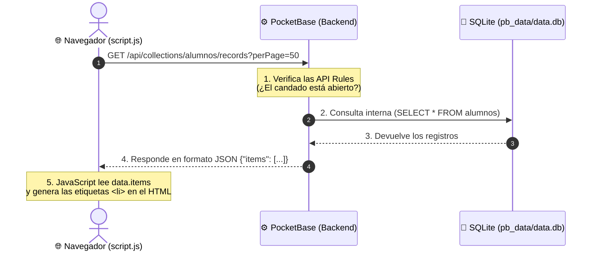

# 🚀 Guía Definitiva: Arquitectura, Backend, Docker y Despliegue en la Nube

Bienvenido a la guía explicativa del proyecto. Si estás empezando en el mundo del **backend** y el **despliegue de aplicaciones**, es totalmente normal sentirse confundido entre tantas tecnologías (`.env`, `Dockerfile`, `docker-compose`, `SQLite`, `Fly.io`).

Aquí desglosamos cada pieza del rompecabezas paso a paso.

---

## 1. 🔍 ¿Dónde está el archivo `.env` en este proyecto?

En este proyecto **NO hay archivo `.env`**, y esto tiene una razón arquitectónica muy clara:

### A. En proyectos tradicionales (Node.js, Python, PHP):
Normalmente tienes un servidor donde programas la conexión a una base de datos externa (como PostgreSQL o MySQL). Allí necesitas un archivo `.env` para guardar secretos como:
```env
DB_HOST=localhost
DB_PORT=5432
DB_USER=postgres
DB_PASSWORD=mi_super_secreto
PORT=3000
```

### B. ¿Por qué NO lo necesitamos con PocketBase?
* **PocketBase es un BaaS (*Backend-as-a-Service*) autocontenido:** Viene con su propia base de datos embebida (**SQLite**). No se conecta a un servidor externo de base de datos a través de la red con contraseñas; los datos se guardan directamente en un archivo local en disco (`pb_data/data.db`).
* **Configuración visual:** Toda la configuración de tablas, usuarios y claves se administra directamente desde el panel web (`/_/`), no mediante variables de entorno.
* **Los puertos se definen al arrancar:** En el comando de inicio le decimos en qué puerto escuchar (`--http=0.0.0.0:8080`).

### C. Una regla de oro sobre el Frontend:
Tu landing page es **HTML y JavaScript que corre en el navegador del cliente**.
> ⚠️ **Importante:** En el frontend del navegador **los `.env` NO aportan seguridad**. Cualquier variable o clave que pongas en un script del navegador es 100% visible para cualquier persona que abra *Inspeccionar Elemento (F12)*.

---

## 2. 🔌 ¿Cómo se conecta la Base de Datos a tu Frontend?

La base de datos **NUNCA** se conecta directamente al frontend por motivos de seguridad (si el navegador se conectara directo a la base de datos, cualquier usuario podría borrar o robar toda la información).

En su lugar, **PocketBase actúa como intermediario (API REST)**:



### ¿Qué hace tu código en [script.js](file:///c:/Users/actos/Desktop/pocketbase/despliegue-apliaciones/Clase%202/Mi%20Landing/public_html/script.js)?

1. **Hace una petición HTTP (`fetch`) al backend:**
   ```javascript
   const response = await fetch('/api/collections/alumnos/records?perPage=50');
   ```
2. **Convierte la respuesta a un objeto JSON:**
   ```javascript
   const data = await response.json();
   ```
3. **Itera cada alumno y lo dibuja en el HTML:**
   ```javascript
   data.items.forEach(alumno => {
       const li = document.createElement('li');
       li.textContent = alumno.nombre || alumno.Nombre;
       lista.appendChild(li);
   });
   ```

---

## 3. 🐳 Dockerfile: La "Receta" del Contenedor

Un `Dockerfile` es un archivo de instrucciones paso a paso para armar una imagen de sistema operativo ligera y autónoma.

En tu proyecto tienes dos Dockerfiles para dos propósitos distintos:

### A. El de la Clase ([Clase 2/Mi Landing/Dockerfile](file:///c:/Users/actos/Desktop/pocketbase/despliegue-apliaciones/Clase%202/Mi%20Landing/Dockerfile))
Sirve únicamente para empaquetar tu landing con el servidor web **Nginx**:
```dockerfile
FROM nginx:alpine                      # 1. Empieza desde una imagen mínima de Nginx
COPY ./public_html /usr/share/nginx/html # 2. Copia tus archivos HTML/JS dentro de Nginx
EXPOSE 80                              # 3. Informa que usará el puerto 80
CMD ["nginx", "-g", "daemon off;"]     # 4. Enciende Nginx en primer plano
```

### B. El de la Raíz para Producción ([Dockerfile](file:///c:/Users/actos/Desktop/pocketbase/Dockerfile))
Sirve para empaquetar **PocketBase Y la Landing juntos**:
```dockerfile
FROM alpine:latest                     # 1. Sistema base Alpine Linux
RUN apk add --no-cache unzip ca-certificates
# 2. Descarga el ejecutable oficial de PocketBase
ADD https://github.com/pocketbase/pocketbase/releases/download/v0.22.21/pocketbase_0.22.21_linux_amd64.zip /tmp/pb.zip
RUN unzip /tmp/pb.zip -d /pb/ && rm /tmp/pb.zip
# 3. Copia la landing a la carpeta de estáticos de PocketBase (pb_public)
COPY ["despliegue-apliaciones/Clase 2/Mi Landing/public_html", "/pb/pb_public"]
EXPOSE 8080
# 4. Arranca PocketBase con su base de datos (/pb/pb_data) y sus estáticos (/pb/pb_public)
CMD ["/pb/pocketbase", "serve", "--http=0.0.0.0:8080", "--dir=/pb/pb_data", "--publicDir=/pb/pb_public"]
```

---

## 4. 🐙 Docker Compose: El Coordinador de Contenedores

Si un `Dockerfile` define **un solo contenedor**, Docker Compose sirve para **orquestar múltiples contenedores que trabajan juntos**.

En tu clase prepararon dos archivos de compose:

### A. Para Entornos Locales ([docker-compose.yml](file:///c:/Users/actos/Desktop/pocketbase/despliegue-apliaciones/Clase%202/Mi%20Landing/docker-compose.yml))
Levanta **2 servicios** en tu computadora:
1. `web` (Nginx): Mapea tu carpeta local `./public_html` en vivo (si cambias un archivo en tu editor, se actualiza al recargar).
2. `pb` (PocketBase): Corre el backend en el puerto `8090` y le crea un volumen llamado `pocketbase_data`.

### B. Para Servidores de Producción VPS ([docker-compose-server.yml](file:///c:/Users/actos/Desktop/pocketbase/despliegue-apliaciones/Clase%202/Mi%20Landing/docker-compose-server.yml))
En un servidor VPS no montas carpetas locales; usas la imagen `landing:v1` que construiste con el `Dockerfile`.

---

## 5. 🚀 Fly.io: Despliegue en la Nube con Persistencia

### ¿Por qué no usamos `docker-compose` en Fly.io?
Plataformas como **Fly.io** o **Render** son *PaaS* (Plataformas como Servicio). No te dan una terminal de Linux para escribir `docker compose up`; ellos gestionan sus propias máquinas virtuales e infraestructura.

Por eso Fly.io usa su propio archivo: **`fly.toml`**.

### ¿Cómo logramos la persistencia de datos?
Por defecto, los contenedores son **efímeros** (si se apagan o se actualizan, todo lo que hayan guardado adentro se borra).

Para evitar que PocketBase pierda tus alumnos y tu usuario admin:
1. En [fly.toml](file:///c:/Users/actos/Desktop/pocketbase/fly.toml) agregamos:
   ```toml
   [[mounts]]
     source = 'pb_data'          # Nombre del disco en Fly
     destination = '/pb/pb_data' # Carpeta dentro del contenedor que no se debe borrar
   ```
2. Fly.io conecta un **disco duro virtual persistente** a esa ruta exacta.
3. Cuando PocketBase guarda información en SQLite, se escribe en el disco persistente. ¡Aunque hagas nuevos despliegues de código, tus datos nunca se pierden!

---

## 📊 Tabla Comparativa Resumen

| Concepto | Desarrollo Local | Servidor VPS Tradicional | Nube Moderna (Fly.io) |
| :--- | :--- | :--- | :--- |
| **Herramienta** | Docker Desktop + Compose | Linux SSH + Docker Compose | Fly CLI / Dashboard + Git |
| **Archivo principal** | [docker-compose.yml](file:///c:/Users/actos/Desktop/pocketbase/despliegue-apliaciones/Clase%202/Mi%20Landing/docker-compose.yml) | [docker-compose-server.yml](file:///c:/Users/actos/Desktop/pocketbase/despliegue-apliaciones/Clase%202/Mi%20Landing/docker-compose-server.yml) | [fly.toml](file:///c:/Users/actos/Desktop/pocketbase/fly.toml) + [Dockerfile](file:///c:/Users/actos/Desktop/pocketbase/Dockerfile) |
| **Frontend** | Nginx sirviendo `./public_html` | Nginx sirviendo imagen `landing:v1` | PocketBase sirviendo `/pb/pb_public` |
| **Persistencia** | Volumen Docker local | Volumen Docker en el VPS | `[[mounts]]` en disco físico de Fly |
| **URL de acceso** | `http://localhost:8080` | `http://IP_DE_TU_VPS:8080` | `https://despliegue-de-apps.fly.dev` |
